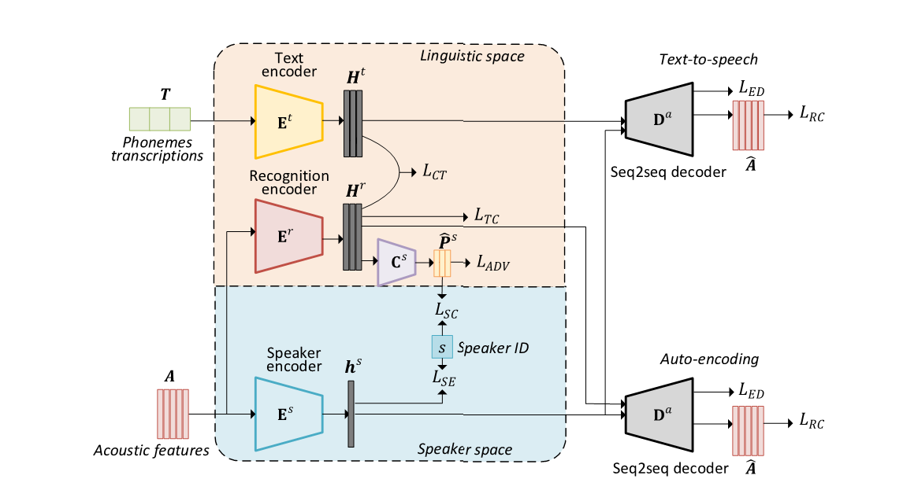

# Non-parallel Seq2seq Voice Conversion

Implementation code of [Non-Parallel Sequence-to-Sequence Voice Conversion with Disentangled Linguistic and Speaker Representations](https://arxiv.org/abs/1906.10508).

For audio samples, please visit our [demo page](https://jxzhanggg.github.io/nonparaSeq2seqVC/).



## Dependencies

* Python 3.6
* PyTorch 1.0.1
* CUDA 10.0

## Data

It is recommended you download the [VCTK](http://homepages.inf.ed.ac.uk/jyamagis/page3/page58/page58.html) and [CMU-ARCTIC](http://www.speech.cs.cmu.edu/cmu_arctic/packed/) datasets.

## Usage

### Installation

Install Python dependencies.

```bash
$ pip install -r requirements.txt
```

### Feature Extraction

#### Extract Mel-Spectrograms, Spectrograms and Phonemes

You can use [`extract_features.py`](https://github.com/jxzhanggg/nonparaSeq2seqVC_code/blob/master/pre-train/reader/extract_features.py)


### Customize data reader

Write a snippet of code to walk through the dataset for generating list file for train, valid and test set.

Then you will need to modify the data reader to read your training data. The following are scripts you will need to modify.

For pre-training:

- [`reader.py`](https://github.com/jxzhanggg/nonparaSeq2seqVC_code/blob/master/pre-train/reader/reader.py)
- [`symbols.py`](https://github.com/jxzhanggg/nonparaSeq2seqVC_code/blob/master/pre-train/reader/symbols.py)

For fine-tuning:

- [`reader.py`](https://github.com/jxzhanggg/nonparaSeq2seqVC_code/blob/master/fine-tune/reader/reader.py)
- [`symbols.py`](https://github.com/jxzhanggg/nonparaSeq2seqVC_code/blob/master/fine-tune/reader/symbols.py)


### Pre-train the model

Add correct paths to your local data, and run the bash script:

```bash
$ cd pre-train
$ bash run.sh
```

Run the inference code to generate audio samples on multi-speaker dataset. During inference, our model can be run on either TTS (using text inputs) or VC (using Mel-spectrogram inputs) mode.

```bash
$ python inference.py
```

### Fine-tune the model

Fine-tune the model and generate audio samples on conversion pair. During inference, our model can be run on either TTS (using text inputs) or VC (using Mel-spectrogram inputs) mode.

```bash
$ cd fine-tune
$ bash run.sh
```

## Training Time

On a single NVIDIA 1080 Ti GPU, with a batch size of 32, pre-training on VCTK takes approximately 64 hours of wall-clock time. Fine-tuning on two speakers (500 utterances each speaker) with a batch size of 8 takes approximately 6 hours of wall-clock time.

## References

* "Non-Parallel Sequence-to-Sequence Voice Conversion with Disentangled Linguistic and Speaker Representations", Jing-Xuan Zhang, Zhen-Hua Ling, Li-Rong Dai, accepted by IEEE/ACM Transactions on Aduio, Speech and Language Processing, vol.28, no. 1, pp. 540-552, 2020.

## Acknowledgements

Part of code was adapted from the following project:
* https://github.com/NVIDIA/tacotron2/
* https://github.com/r9y9/deepvoice3_pytorch
